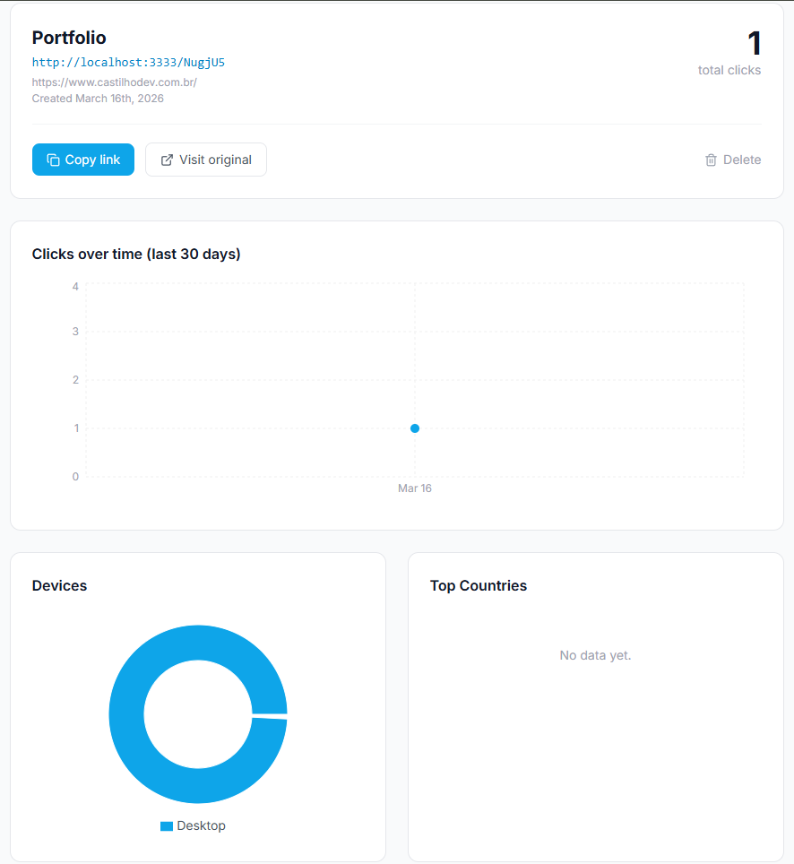

# Shortify — Encurtador de URLs com Dashboard de Analytics


> Um encurtador de URLs com painel de analytics em tempo real. Cole uma URL longa, receba uma URL curta, e acompanhe cliques por dispositivo, país e origem — com cache Redis para redirects em sub-milissegundos.



---

## Stack

| Categoria | Tecnologia |
|---|---|
| Runtime | Node.js 20 LTS |
| Linguagem | TypeScript (strict mode) |
| Framework | Fastify — performático, ideal para redirects em alta velocidade |
| ORM | Prisma — migrations automáticas e type safety completo |
| Banco principal | PostgreSQL 16 |
| Cache | Redis 7 — elimina hits no banco em cada redirect |
| Validação | Zod — validação de schema nas rotas |
| Testes | Vitest + Supertest |
| Docs API | Swagger via @fastify/swagger |
| Frontend | React 18 + TypeScript + Vite |
| Estilização | Tailwind CSS |
| Gráficos | Recharts |
| HTTP Client | Axios + TanStack Query |
| Containers | Docker + Docker Compose |
| CI/CD | GitHub Actions |

---

## Arquitetura — Fluxo de Redirect com Cache

```
GET /:slug
  │
  ├─ Redis HIT?  ──────► HTTP 302 (sem tocar no banco)
  │                       └─ registra clique async (setImmediate)
  │
  └─ Redis MISS
       └─ PostgreSQL
            ├─ Not found ──► 404
            ├─ Expired   ──► 410
            └─ Found
                 ├─ SET Redis (TTL 24h)
                 ├─ registra clique async (não bloqueia o redirect)
                 └─ HTTP 302
```

**Por que Redis aqui?**

Num encurtador de URLs, o redirect é a rota mais acessada — e é acessada repetidamente pelo mesmo slug. Sem cache, cada acesso geraria uma query ao PostgreSQL. Com Redis, a URL original fica em memória com TTL de 24h. O resultado é um redirect que resolve em ~1ms em vez de ~10-50ms, e o banco fica livre para operações que realmente importam.

**Por que o clique é registrado com `setImmediate`?**

O usuário não precisa esperar o analytics ser salvo para ser redirecionado. Usar `setImmediate` move o `INSERT` no banco para depois que a resposta HTTP já foi enviada, mantendo a latência do redirect mínima mesmo com analytics habilitado.

---

## Como rodar

### Pré-requisitos

- Docker e Docker Compose
- Node.js 20+ (para desenvolvimento local)

### Com Docker (recomendado)

```bash
# Clone o repositório
git clone https://github.com/pedroocastilho/url-shortener.git
cd url-shortener

# Suba todos os serviços
docker compose up -d

# Acesse:
# Frontend:  http://localhost:5173
# API:       http://localhost:3333
# Docs API:  http://localhost:3333/docs
```

### Desenvolvimento local

```bash
# 1. Suba apenas os serviços de infraestrutura
docker compose up -d postgres redis

# 2. Configure o backend
cd backend
cp .env.example .env
npm install
npx prisma migrate dev
npm run dev

# 3. Em outro terminal, configure o frontend
cd frontend
cp .env.example .env
npm install
npm run dev
```

---

## API Reference

| Método | Rota | Descrição |
|---|---|---|
| `POST` | `/api/urls` | Cria uma URL encurtada |
| `GET` | `/api/urls` | Lista todas as URLs com total de cliques |
| `GET` | `/api/urls/:id` | Retorna detalhes de uma URL |
| `DELETE` | `/api/urls/:id` | Remove uma URL e todos os seus cliques |
| `GET` | `/api/urls/:id/analytics` | Analytics: cliques por dia, dispositivo, país, referrer |
| `GET` | `/:slug` | Redireciona para a URL original (HTTP 302) |

Documentação interativa disponível em `/docs` após subir o servidor.

**Exemplo — criar URL:**

```bash
curl -X POST http://localhost:3333/api/urls \
  -H "Content-Type: application/json" \
  -d '{"originalUrl": "https://exemplo.com/artigo-muito-longo", "title": "Meu artigo"}'
```

```json
{
  "id": "clx1abc...",
  "slug": "aB3xYz",
  "originalUrl": "https://exemplo.com/artigo-muito-longo",
  "shortUrl": "http://localhost:3333/aB3xYz",
  "title": "Meu artigo",
  "totalClicks": 0,
  "createdAt": "2024-06-15T10:00:00.000Z"
}
```

---

## Testes

```bash
cd backend

# Todos os testes
npm test

# Apenas unitários (sem necessidade de banco/Redis)
npm run test:unit

# Apenas integração (requer PostgreSQL e Redis rodando)
npm run test:integration

# Com coverage
npm run test:coverage
```

**Estratégia:**

- **Unitários:** toda a lógica de negócio testada com Redis e Prisma mockados via `vi.mock()`. Cobre: geração de slug, cache hit/miss, expiração, retry de colisão, parsing de device e referrer.
- **Integração:** testa os endpoints HTTP de ponta a ponta contra um banco real em container. Verifica o fluxo completo: criação → redirect → analytics.

---

## Estrutura de pastas

```
url-shortener/
├── backend/
│   ├── src/
│   │   ├── modules/
│   │   │   ├── url/               # Controller, Service, Repository, Schema
│   │   │   └── analytics/         # Service, Repository
│   │   ├── infra/
│   │   │   ├── database/          # Prisma client singleton
│   │   │   ├── cache/             # Redis client
│   │   │   └── http/              # Fastify server + plugins
│   │   └── shared/
│   │       ├── errors/            # AppError class
│   │       └── utils/             # slug generator, user-agent parser
│   ├── prisma/schema.prisma
│   └── tests/
│       ├── unit/
│       └── integration/
└── frontend/
    └── src/
        ├── pages/                 # Home, Dashboard, LinkDetail
        ├── components/            # LinkCard, ClicksChart, DevicesPieChart
        ├── services/              # Axios + TanStack Query hooks
        └── types/
```

---

## Variáveis de ambiente

### Backend (`backend/.env`)

| Variável | Padrão | Descrição |
|---|---|---|
| `DATABASE_URL` | — | Connection string do PostgreSQL |
| `REDIS_HOST` | `localhost` | Host do Redis |
| `REDIS_PORT` | `6379` | Porta do Redis |
| `PORT` | `3333` | Porta do servidor HTTP |
| `BASE_URL` | `http://localhost:3333` | URL base para gerar short URLs |
| `SLUG_LENGTH` | `6` | Comprimento do slug gerado |
| `CACHE_TTL_SECONDS` | `86400` | TTL do cache Redis (24h) |

### Frontend (`frontend/.env`)

| Variável | Padrão | Descrição |
|---|---|---|
| `VITE_API_URL` | `http://localhost:3333` | URL base da API |

---

## Decisões de arquitetura

**Por que Fastify em vez de Express?**
Fastify tem throughput ~2x maior em benchmarks de redirect simples, que é exatamente o caso de uso principal deste projeto. O schema de validação integrado via JSON Schema também melhora performance no parsing das rotas.

**Por que Prisma em vez de SQL raw?**
Type safety completo e migrations automáticas tornam o desenvolvimento mais seguro. Para as queries de agrupamento de analytics, foi usado `$queryRaw` pontualmente onde o Prisma não gera SQL eficiente por conta própria.

**Por que nanoid em vez de UUID para o slug?**
UUIDs têm 36 caracteres — ruim para uma URL curta. Nanoid com alfabeto alfanumérico e 6 caracteres gera 62⁶ ≈ 56 bilhões de combinações, tornando colisões virtualmente impossíveis na escala de uso típica.

---

*Pedro Castilho • castilhodev.com.br • github.com/pedroocastilho*
